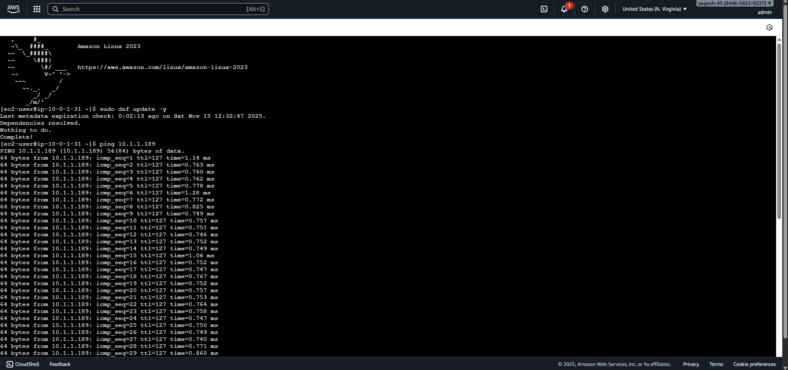
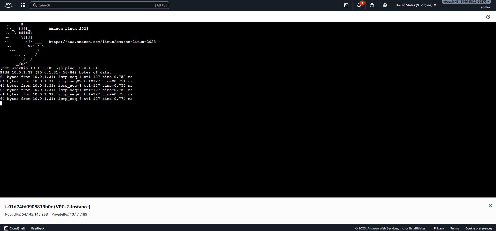
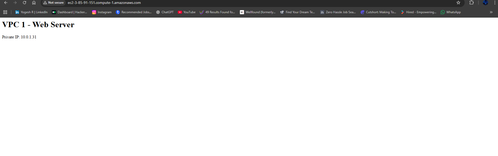
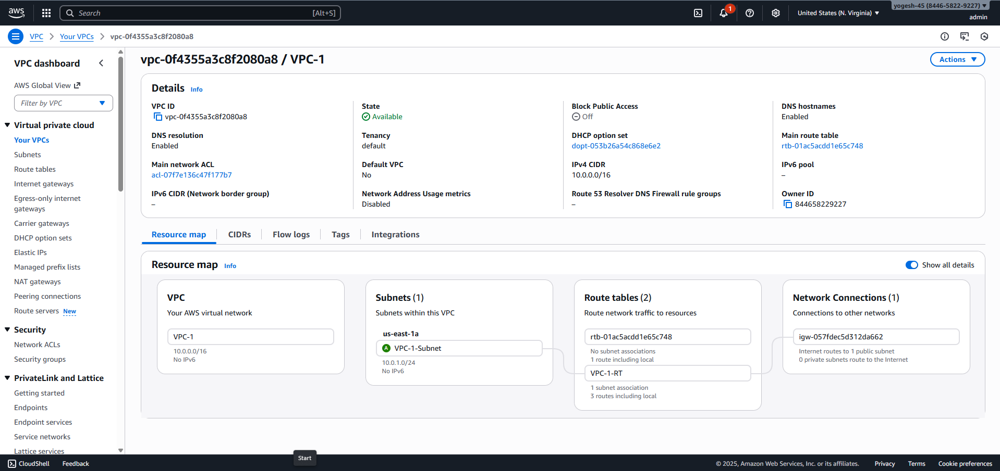

# VPC Peering Architecture – CloudFormation Deployment

**Author:** Yogesh R
**Date:** 2025-11-15

---

# Table of Contents

1. [Overview](#overview)
2. [Architecture Diagram](#architecture-diagram)
3. [What This Stack Deploys](#what-this-stack-deploys)
4. [How the Architecture Works](#how-the-architecture-works)
5. [CloudFormation Template Breakdown](#cloudformation-template-breakdown)

   * 5.1 [Key Pair](#key-pair)
   * 5.2 [VPC 1 Components](#vpc-1-components)
   * 5.3 [VPC 2 Components](#vpc-2-components)
   * 5.4 [VPC Peering](#vpc-peering)
6. [Deployment Steps](#deployment-steps)
7. [Testing Connectivity](#testing-connectivity)
8. [Screenshots](#screenshots)
8. [Outputs](#outputs)
9. [Cleanup](#cleanup)

---

# Overview

This project deploys **two VPCs** using AWS CloudFormation, each containing:

* One public subnet
* One EC2 instance running Apache HTTP server
* Security groups allowing SSH, HTTP, and cross‑VPC ICMP
* Internet Gateway and routing

A **VPC Peering Connection** is created between the VPCs so the instances can communicate privately. This setup is ideal for learning or demonstrating VPC‑to‑VPC communication.

---

# Architecture Diagram

```
                  +----------------------+         +----------------------+
                  |        VPC 1         |         |        VPC 2         |
                  |   10.0.0.0/16        |         |   10.1.0.0/16        |
                  |                      |         |                      |
        IGW ----> |  Public Subnet       | <-----> |  Public Subnet       | <---- IGW
                  | 10.0.1.0/24          |   Peer  | 10.1.1.0/24          |
                  |    EC2 Instance      |         |   EC2 Instance       |
                  +----------------------+         +----------------------+

                 Internet Access Enabled        Internet Access Enabled
```

---

# What This Stack Deploys

* 2 VPCs (10.0.0.0/16 and 10.1.0.0/16)
* Public subnets in different AZs
* Internet Gateways and routing
* Security groups with HTTP, SSH, ICMP rules
* EC2 instances with HTTP servers
* VPC Peering Connection
* Route tables updated for cross‑VPC communication
* Useful CloudFormation outputs (public URLs & peering ID)

---

# How the Architecture Works

* Each EC2 instance is in a public subnet and accessible via the Internet.
* HTTPD auto‑installs on boot using **UserData**.
* VPC Peering enables **private communication** between the EC2s using private IPs.
* Security groups explicitly allow ICMP from the other VPC's CIDR.
* Route tables send VPC-to-VPC traffic over the peering connection.

---

# CloudFormation Template Breakdown

## 5.1 Key Pair

Creates an EC2 key pair for SSH access.

## 5.2 VPC 1 Components

* VPC (10.0.0.0/16)
* Public subnet (10.0.1.0/24)
* Internet Gateway and routing
* Security group allowing SSH, HTTP, ICMP from VPC2
* EC2 instance with Apache

## 5.3 VPC 2 Components

* VPC (10.1.0.0/16)
* Public subnet (10.1.1.0/24)
* Internet Gateway and routing
* Security group allowing SSH, HTTP, ICMP from VPC1
* EC2 instance with Apache

## 5.4 VPC Peering

* VPCPeeringConnection between VPC1 and VPC2
* Routes added in both route tables

---

# Deployment Steps

1. Open AWS Console and go to **CloudFormation**.
2. Choose **Create stack** → *Upload template*.
3. Upload the provided YAML file.
4. Keep parameters default unless required.
5. Deploy the stack.
6. Wait for status **CREATE_COMPLETE**.
7. Check **Outputs** to get:

   * VPC1 Web URL
   * VPC2 Web URL
   * Peering Connection ID

---

# Testing Connectivity

### 1. Validate HTTP servers

Open browser:

* `http://<VPC1-DNS>`
* `http://<VPC2-DNS>`

### 2. Test ICMP cross‑VPC

From VPC1 instance:

```
ping <VPC2-Private-IP>
```

From VPC2 instance:

```
ping <VPC1-Private-IP>
```

If routing + SGs are correct, ICMP replies will return.

---

# Screenshots






---

# Outputs

The template exposes:

* VPC1 Web URL
* VPC2 Web URL
* Peering Connection ID

These values appear in the CloudFormation stack Outputs tab.

---

# Cleanup

To avoid unwanted charges:

1. Delete the CloudFormation stack.
2. Confirm deletion of all created resources.
3. Ensure EC2 key pair is removed if no longer needed.

---


